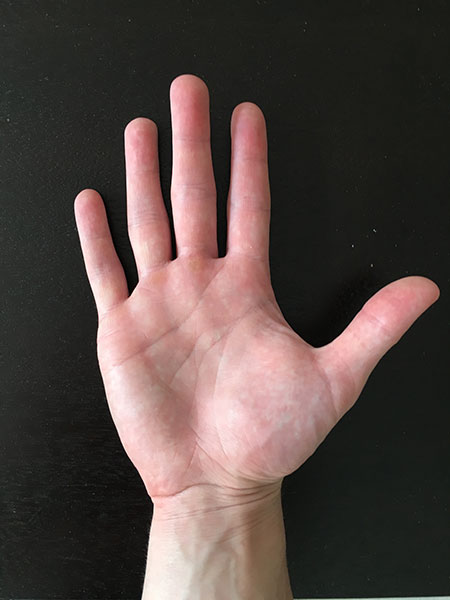
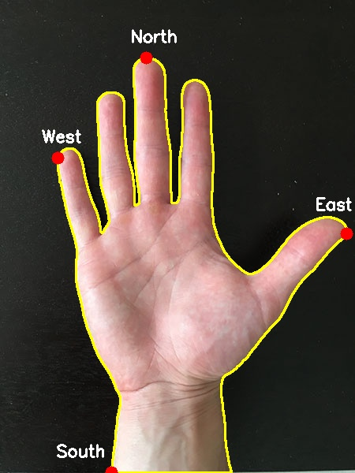

# Finding extreme points in contours

## our goal
- find the large object
- draw contour on the object
- find the most left, right, top, buttom pixel in the contour (extreme point)
- draw circle on each extreme point

## Run the code
```
$ python find-extreme-points.py --image input.jpg
```

## Image For Testing


## Output


## Source and full explanation
[pyimagesearch blog](https://www.pyimagesearch.com/2016/04/11/finding-extreme-points-in-contours-with-opencv/)