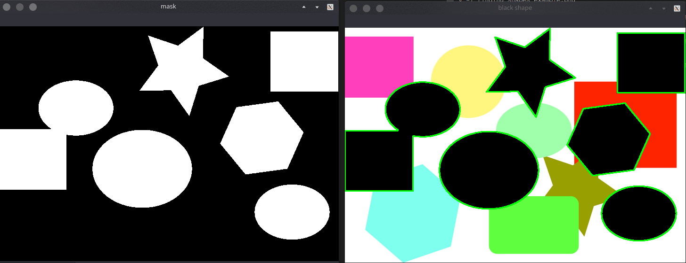

# Finding Shapes in Images

## Our goal : 
- Recognize only figures with the black background
- If 2 or more figures overlap they all should be treated as one object
- Detect and draw contours around each of the black shapes
- Count the number of black shapes

## Run the code
```
$ python find-image-shape.py --image test_image.png
```

## Image For Testing


## Output


## Source and full explanation
[pyimagesearch blog](https://www.pyimagesearch.com/2014/10/20/finding-shapes-images-using-python-opencv/)